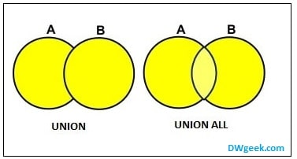
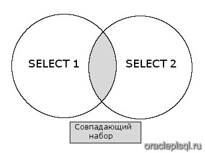
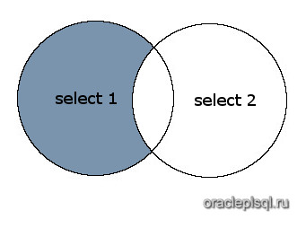
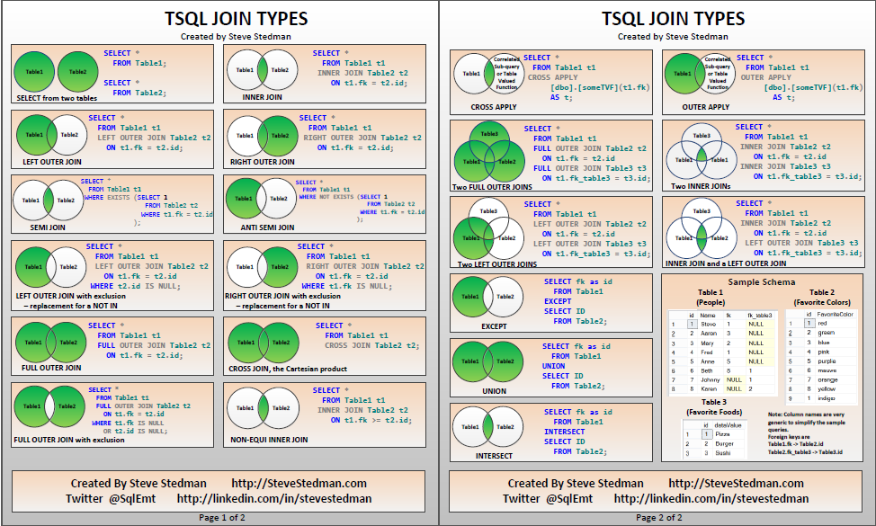

# SQL

## DDL - Data Definition Language

### CREATE

> Создает данные

```sql
    CREATE TABLE  table_name (
        column_name1 data_type(size),
        column_name2 data_type(size),
        column_name3 data_type(size)
        ...
    )
```

### ALTER

> Добавляет данные

```sql
    ALTER TABLE table_name
    ADD column_name data_type
```
* `ADD COLUMN column_name data_type` - добавляет новый столбец 
* `RENAME TO new_table_name` - переименовать таблицу
* `RENAME old_column_name TO new_column_name` - переименовать столбец
* `ALTER COLUMN column_name SET DATA TYPE data_type` - новый тип данных для солбца

### DROP

> Удаляет все

```sql
    DROP [ INDEX | TABLE | DATABASE | COLUMN ] object
```

### TRANCATE

> Удаляет все данные в таблице, если там нет ссылок на другие таблицы.

```sql
    TRUNCATE TABLE table_name
```


## DML - Data Manipulation Language

### SELECT
```sql
    SELECT 
        column1, column2, ...
    FROM 
        table_name;
    JOIN 
        table_name ON condition
    WHERE 
        conditions
    GROUP BY 
        column_name
    HAVING 
        aggregate_function(column_name) operator value
    ORDER BY 
        column_name ASC/DESC
    LIMIT 
        first_value [, last_value]
```

### INSERT

### UPDATE

### DELETE

## Math

* `+` - сложение
* `-` - вычитание 
* `*` - умножение 
* `/` - деление 
* `^` - степень 
* `|/` - квадратный корень
* ect...

## Functions

### COUNT - функция возвращающая количество записей (строк) таблицы.
```sql
    SELECT COUNT(*)
    FROM table_name
```

### MIN - функция возвращающая минимальное значение столбца
```sql
    SELECT MIN(column_name)
    FROM table_name
```

### MAX - ункция возвращающая максимальное значение столбца таблицы
```sql
    SELECT MAX(column_name)
    FROM table_name
```

### AVG - функция возвращающая среднее значение столбца
```sql
    SELECT AVG(column_name)
    FROM table_name
```

### SUM — функция, возвращающая сумму значений столбца таблицы
```sql
    SELECT SUM(column_name)
    FROM table_name
```


## Operators

### AS 
> Для именования результирующих столбцов при выборке элементов

```sql
    SELECT column_name AS new_column_name 
    FROM table_name
```

### DISTINCT - только уникальне значения столбца
```sql
    SELECT DISTINCT column_name 
    FROM table_name
```

### BETWEEN - задает диапазон, в котором будет осуществляться проверка условия
```sql
    SELECT *
    FROM table_name
    WHERE column_name BETWEEN 100 AND 300
```

### IN - позволяет определить, совпадает ли значение объекта со значением в списке
| Используется вместо перечисления через OR оператор
```sql
    SELECT *
    FROM table_name
    WHERE column_name IN ('UK', 'USA')
```

### NOT - служит для задания противоположно заданного условия
```sql
    SELECT *
    FROM table_name
    WHERE column_name NOT IN ('UK', 'USA')
```

### LIKE - устанавливает соответствие символьной строки с шаблоном

Pattern matching:

`%` - placeholder означающий 0,1 и более символов

`_` - ровно 1 любой символ

* `LIKE 'U%'` - строки, начинающиеся с U
* `LIKE '%a'` - строки, кончающиеся на а
* `LIKE '%John%'` - строки, содержащие John
* `LIKE 'J%n'` - строки, начинающиеся на J, и кончающиеся на п
* `LIKE '_oh_'` - строки, где 2, 3 символы - oh, а первый (1) и последний (4) - любые
* `LIKE '_oh%'` - строки, где 2, 3 символы - oh, первый - любой и в конце 0, 1 и более любых символов

```sql
    SELECT *
    FROM table_name
    WHERE column_name NOT IN ('UK', 'USA')
```

### UNION / UNION ALL - объединения двух и более запросов

```sql
    SELECT column_name(s) FROM table1
    UNION
    SELECT column_name(s) FROM table2
```

### INTERSECT - выбирает пересечения двух и более запросов

```sql
    SELECT column_name(s) FROM table1
    INTERSECT
    SELECT column_name(s) FROM table2
```

### MINUS / EXCEPT - вернет все строки с первого SELECT, которые не вернулись вторым SELECT

```sql
    SELECT column_name(s) FROM table1
    EXCEPT
    SELECT column_name(s) FROM table2
```

### ANY 

> Возвращает TRUE, если какое-либо из значений подзапроса соответствует условию.
> 
```sql
    SELECT column_name
    FROM table_name
    WHERE column_id = ANY(
        SELECT column_name
        FROM table_name
        WHERE couns > 7
    );
```

### ALL 

> Возвращает TRUE, если все значения подзапроса удовлетворяют условию.

```sql
    SELECT column_name
    FROM table_name
    WHERE column_id = ALL (
        SELECT column_name
        FROM table_name
        WHERE couns = 7
    );
```

## Joins



* INNER JOIN or JOIN
* LEFT, RIGHT
* FULL
* CROSS
* SELF

```sql
    SELECT
        column_names [,... n]
    FROM
        table_name_1 
    JOIN table_name_2 ON table_name_1.column_id = table_name_2.column_id
```

### USING (column_name(s))
> Является синтаксическим сахаром над ON.
>  Cлужит для указания списка столбцов, которые должны существовать в обеих таблицах.

```sql
    SELECT
        column_names [,... n]
    FROM
        table_name_1 
    JOIN table_name_2 USING(column_id)
```

## Subqueries

> Обычно можно переписать через join и join чаще всего будут быстрее выполняться. Поэтому лучше после написания подзапроса(если он проще сотсвлялся), переписать все на join, если это возможно.

```sql
    SELECT column_name
    FROM table_name
    WHERE conditions IN
		(SELECT  column_name
			FROM table_name)
```

### Where exists

```sql
    SELECT column_name
    FROM table_name
    WHERE EXISTS
		(SELECT  column_name
			FROM table_name)
```