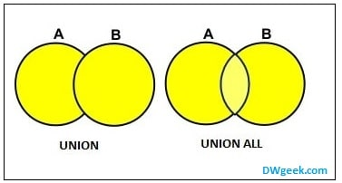
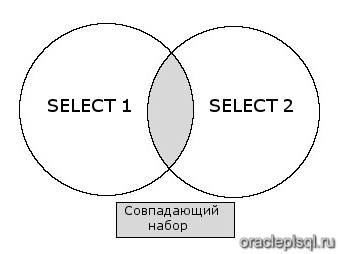
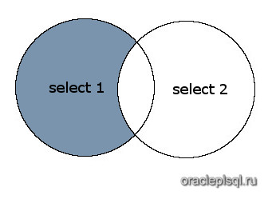

# Functions

## COUNT 

Функция возвращающая количество записей (строк) таблицы.

```sql
    SELECT COUNT(*)
    FROM table_name
```

## MIN

> Функция возвращающая минимальное значение столбца

```sql
    SELECT MIN(column_name)
    FROM table_name
```

## MAX

> Функция возвращающая максимальное значение столбца таблицы

```sql
    SELECT MAX(column_name)
    FROM table_name
```

## AVG 

> Функция возвращающая среднее значение столбца

```sql
    SELECT AVG(column_name)
    FROM table_name
```

## SUM

> Функция, возвращающая сумму значений столбца таблицы

```sql
    SELECT SUM(column_name)
    FROM table_name
```


# Operators

## AS 

> Для именования результирующих столбцов при выборке элементов

```sql
    SELECT column_name AS new_column_name 
    FROM table_name
```

## DISTINCT

> Только уникальне значения столбца

```sql
    SELECT DISTINCT column_name 
    FROM table_name
```

## BETWEEN

> Задает диапазон, в котором будет осуществляться проверка условия

```sql
    SELECT *
    FROM table_name
    WHERE column_name BETWEEN 100 AND 300
```

## IN

> Позволяет определить, совпадает ли значение объекта со значением в списке
> 
> Используется вместо перечисления через OR оператор

```sql
    SELECT *
    FROM table_name
    WHERE column_name IN ('UK', 'USA')
```

## NOT

> Служит для задания противоположно заданного условия

```sql
    SELECT *
    FROM table_name
    WHERE column_name NOT IN ('UK', 'USA')
```

## LIKE

> Устанавливает соответствие символьной строки с шаблоном

Pattern matching:

`%` - placeholder означающий 0,1 и более символов

`_` - ровно 1 любой символ

* `LIKE 'U%'` - строки, начинающиеся с U
* `LIKE '%a'` - строки, кончающиеся на а
* `LIKE '%John%'` - строки, содержащие John
* `LIKE 'J%n'` - строки, начинающиеся на J, и кончающиеся на п
* `LIKE '_oh_'` - строки, где 2, 3 символы - oh, а первый (1) и последний (4) - любые
* `LIKE '_oh%'` - строки, где 2, 3 символы - oh, первый - любой и в конце 0, 1 и более любых символов

```sql
    SELECT *
    FROM table_name
    WHERE column_name NOT IN ('UK', 'USA')
```

## UNION / UNION ALL

> Объединения двух и более запросов



```sql
    SELECT column_name(s) FROM table1
    UNION
    SELECT column_name(s) FROM table2
```

## INTERSECT

> Выбирает пересечения двух и более запросов



```sql
    SELECT column_name(s) FROM table1
    INTERSECT
    SELECT column_name(s) FROM table2
```

## MINUS / EXCEPT

> Вернет все строки с первого SELECT, которые не вернулись вторым SELECT



```sql
    SELECT column_name(s) FROM table1
    EXCEPT
    SELECT column_name(s) FROM table2
```

## ANY 

> Возвращает TRUE, если какое-либо из значений подзапроса соответствует условию.
> 
```sql
    SELECT column_name
    FROM table_name
    WHERE column_id = ANY(
        SELECT column_name
        FROM table_name
        WHERE couns > 7
    );
```

## ALL 

> Возвращает TRUE, если все значения подзапроса удовлетворяют условию.

```sql
    SELECT column_name
    FROM table_name
    WHERE column_id = ALL (
        SELECT column_name
        FROM table_name
        WHERE couns = 7
    );
```