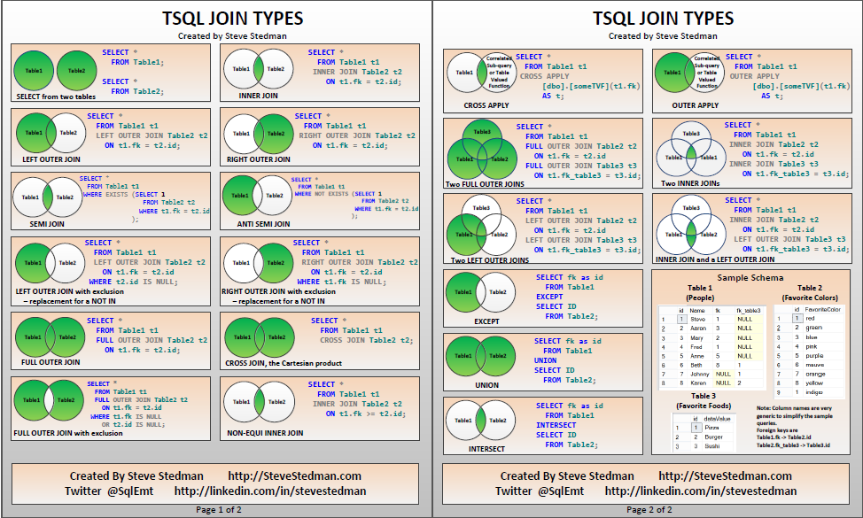

# Joins



* INNER JOIN or JOIN
* LEFT, RIGHT
* FULL
* CROSS
* SELF

```sql
    SELECT
        column_names [,... n]
    FROM
        table_name_1 
    JOIN table_name_2 ON table_name_1.column_id = table_name_2.column_id
```

## USING (column_name(s))
> Является синтаксическим сахаром над ON.
>  Cлужит для указания списка столбцов, которые должны существовать в обеих таблицах.

```sql
    SELECT
        column_names [,... n]
    FROM
        table_name_1 
    JOIN table_name_2 USING(column_id)
```

# Subqueries

> Обычно можно переписать через join и join чаще всего будут быстрее выполняться. Поэтому лучше после написания подзапроса(если он проще сотсвлялся), переписать все на join, если это возможно.

```sql
    SELECT column_name
    FROM table_name
    WHERE conditions IN
		(SELECT  column_name
			FROM table_name)
```

## Where exists

```sql
    SELECT column_name
    FROM table_name
    WHERE EXISTS
		(SELECT  column_name
			FROM table_name)
```

# CTE - Common Table Expression

> Как подзапросы, но только более гибкие и удобные, могут быть рекурсивными
> 
> Позволяют строить временные таблицы (или представления) в рамках большого запроса

```sql
    WITH name AS (
        SELECT clause
    )
    SELECT «using WITH part»
```